# Architecture

### IMPLEMENTS
- [X] Implement **CQRS**
- [X] Implement **SAGA**
- [X] Implement **Event Sourcing**
- [X] Implement **gRPC**
- [X] Implement *Kafka*
- [X] Implement *Kafka Sink/Source Connector*
- [X] Implement Distributed Tracing using **Jaeger**
- [X] Implement Metrics Collector using **Prometheus**
- [X] Implement Service Discovery using **Consul**
- [X] Implement Load Balance And Reverse Proxy using **Traefik**
- [X] Implement **Worker Pools**

### SERVICES
- API-GATEWAY
- USER-SERVICE
- PRODUCT-SERVICE
- PAYMENT-SERVICE
- SHIPPING-SERVICE

### FLOW

```mermaid
flowchart TD

    subgraph API-Gateway
        GW[API-Gateway]
    end

    %% --- User Service ---
    subgraph UserService[USER-SERVICE]
        US_CMD[Command Handler - Kafka Consumer]
        US_Q[Query Handler - gRPC]
        US_DB[(PostgreSQL - users)]
        US_EVT[(MongoDB - user_event_store)]
    end

    %% --- Product Service ---
    subgraph ProductService[PRODUCT-SERVICE]
        PS_CMD[Command Handler - Kafka Consumer]
        PS_Q[Query Handler - gRPC]
        PS_DB[(PostgreSQL - products)]
        PS_ES[(Elasticsearch Index)]
        PS_EVT[(MongoDB - product_event_store)]
    end

    %% --- Payment Service ---
    subgraph PaymentService[PAYMENT-SERVICE]
        PAY_CMD[Command Handler - Kafka Consumer]
        PAY_Q[Query Handler - gRPC]
        PAY_DB[(PostgreSQL - payments)]
        PAY_EVT[(MongoDB - payment_event_store)]
    end

    %% --- Shipping Service ---
    subgraph ShippingService[SHIPPING-SERVICE]
        SHIP_CMD[Command Handler - Kafka Consumer]
        SHIP_Q[Query Handler - gRPC]
        SHIP_DB[(PostgreSQL - shipping)]
        SHIP_EVT[(MongoDB - shipping_event_store)]
    end

    %% --- Notification Service ---
    subgraph NotificationService[NOTIFICATION-SERVICE]
        NOTIF_SRC[(MongoDB - notification_templates)]
        NOTIF_CMD[Command Handler - Kafka Consumer]
        NOTIF_Q[Query Handler - gRPC]
        NOTIF_EVT[(MongoDB - notification_event_store)]
    end

    %% --- Kafka Bus ---
    subgraph Kafka
        TOPIC_CMD[Command Topics]
        TOPIC_EVT[Event Topics]
    end

    %% API Gateway sends commands to Kafka
    GW -- Command --> TOPIC_CMD

    %% Commands consumed by services
    TOPIC_CMD --> US_CMD
    TOPIC_CMD --> PS_CMD
    TOPIC_CMD --> PAY_CMD
    TOPIC_CMD --> SHIP_CMD
    TOPIC_CMD --> NOTIF_CMD

    %% Each service persists via Sink Connector
    US_CMD -->|Sink Connector| US_DB
    US_CMD -->|Sink Connector| US_EVT

    PS_CMD -->|Sink Connector| PS_DB
    PS_CMD -->|Sink Connector| PS_ES
    PS_CMD -->|Sink Connector| PS_EVT

    PAY_CMD -->|Sink Connector| PAY_DB
    PAY_CMD -->|Sink Connector| PAY_EVT

    SHIP_CMD -->|Sink Connector| SHIP_DB
    SHIP_CMD -->|Sink Connector| SHIP_EVT

    NOTIF_CMD -->|Sink Connector| NOTIF_EVT
    NOTIF_SRC -- Source Connector --> TOPIC_CMD

    %% Query flow
    GW -- gRPC Query --> US_Q
    GW -- gRPC Query --> PS_Q
    GW -- gRPC Query --> PAY_Q
    GW -- gRPC Query --> SHIP_Q
    GW -- gRPC Query --> NOTIF_Q

```

## Author
* Fery Reza Aditya
* feryreza85@gmail.com

