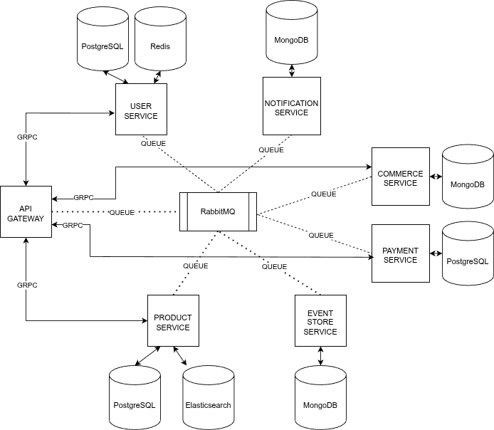

# Architecture

### TODO
- [X] Implement **GraphQL** on API-GATEWAY
- [X] Implement **CQRS**
- [X] Implement **SAGA**
- [X] Implement **Event Sourcing**
- [X] Implement **Circuit Breaker**
- [X] Implement **gRPC**
- [X] Implement message queuing using **RabbitMQ**
- [X] Implement Distributed Tracing using **Jaeger**
- [X] Implement Metrics Collector using **Prometheus**
- [X] Implement Service Discovery using **Consul**
- [X] Implement Load Balance And Reverse Proxy using **Traefik**

## Author
* Fery Reza Aditya
* feryreza85@gmail.com
* github.com/Ferza17

