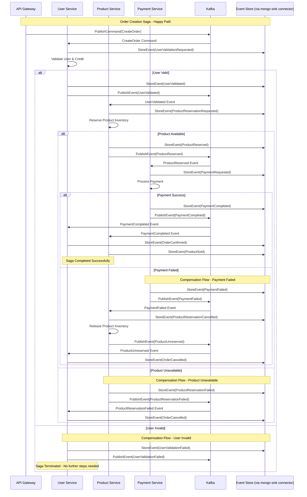

# Naming Convention for RabbitMQ
---
## SNAPSHOT /  CHANGELOG TOPIC
- naming convention for snapshot / changelog :`snapshot-<namespace>-<event_type>`
- naming convention for compensation snapshot / changelog :`compensate-snapshot-<namespace>-<event_type>`
- naming convention for confirm snapshot / changelog :`confirm-snapshot-<namespace>-<event_type>`

### Example : 
- `snapshot-users-users_login`
- `snapshot-users-users_created`
- `snapshot-users-users_updated`
---

## SINK CONNECTOR
- naming convention for sink/connector :`<connector_type>-<provider>-<namespace>-<table or collection>`
- naming convention for sink/connector error handler :`dlq-<connector_type>-<provider>-<namespace>-<table or collection>`

### Example :
- `sink-pg-users-users`
- `source-mongo-notification-notification_templates`
---

## EXAMPLE FLOW
