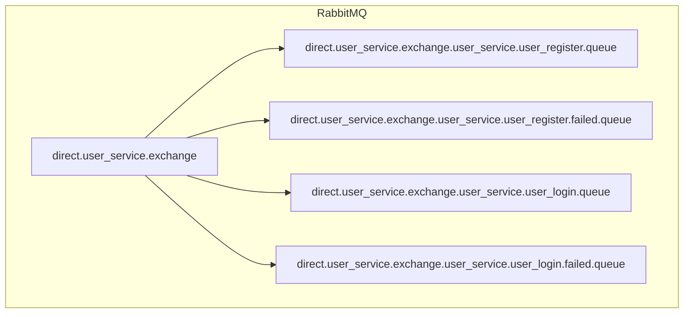

# Naming Convention for RabbitMQ
## EXCHANGE
naming convention : `<kind>.<exchange_owner_name>.exchange`    

example : 
- `direct.user_service.exchange`
- `direct.payment_service.exchange`
- `delayed.payment_service.exchange`
- `direct.notification.exchange`
- `direct.event_store_service.exchange`
---
## QUEUE
naming convention :`<exchange>.<queue_owner_name>.<type>.<optional status>.queue`

example : 
- `direct.user_service.exchange.user_service.user_register.queue`
- `direct.user_service.exchange.user_service.user_register.failed.queue`
- `direct.user_service.exchange.user_service.user_login.queue`
- `direct.user_service.exchange.user_service.user_login.failed.queue`
- `direct.payment_service.exchange.payment_service.order_created.queue`
- `direct.payment_service.exchange.payment_service.order_created.failed.queue`
- `delayed.payment_service.exchange.payment_service.order_delayed_cancel.queue`
- `delayed.payment_service.exchange.payment_service.order_delayed_cancel.failed.queue`
- `direct.event_store_service.exchange.event_store_service.append.queue`
- `direct.event_store_service.exchange.event_store_service.append.failed.queue`
- `direct.event_store_service.exchange.api_gateway.append.queue`

# RabbitMQ Naming Convention (Mermaid Visualization)

```mermaid
flowchart TD
    subgraph UserService
        US[direct.user_service.exchange]
        USQ1[direct.user_service.exchange.user_service.user_register.queue]
        USQ2[direct.user_service.exchange.user_service.user_register.failed.queue]
        USQ3[direct.user_service.exchange.user_service.user_login.queue]
        USQ4[direct.user_service.exchange.user_service.user_login.failed.queue]
    end
    

    subgraph PaymentService
        PS[direct.payment_service.exchange]
        PSQ1[direct.payment_service.exchange.payment_service.order_created.queue]
        PSQ2[direct.payment_service.exchange.payment_service.order_created.failed.queue]

        DPS[delayed.payment_service.exchange]
        DPSQ1[delayed.payment_service.exchange.payment_service.order_delayed_cancel.queue]
        DPSQ2[delayed.payment_service.exchange.payment_service.order_delayed_cancel.failed.queue]
    end

    subgraph EventStore
        ES[direct.event_store_service.exchange]
        ESQ1[direct.event_store_service.exchange.event_store_service.append.queue]
        ESQ2[direct.event_store_service.exchange.event_store_service.append.failed.queue]
        ESQ3[direct.event_store_service.exchange.api_gateway.append.queue]
    end

    subgraph Notification
        NS[direct.notification.exchange]
    end

    %% Connections
    US --> USQ1
    US --> USQ2
    US --> USQ3
    US --> USQ4

    PS --> PSQ1
    PS --> PSQ2
    DPS --> DPSQ1
    DPS --> DPSQ2

    ES --> ESQ1
    ES --> ESQ2
    ES --> ESQ3

    NS
    
```

